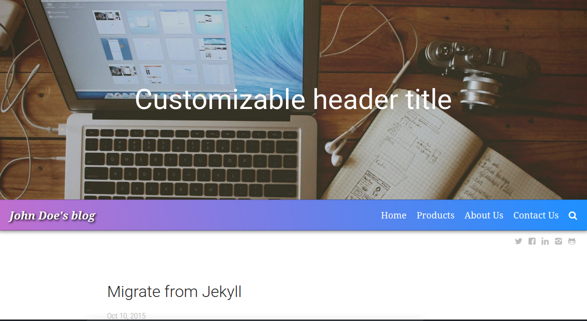
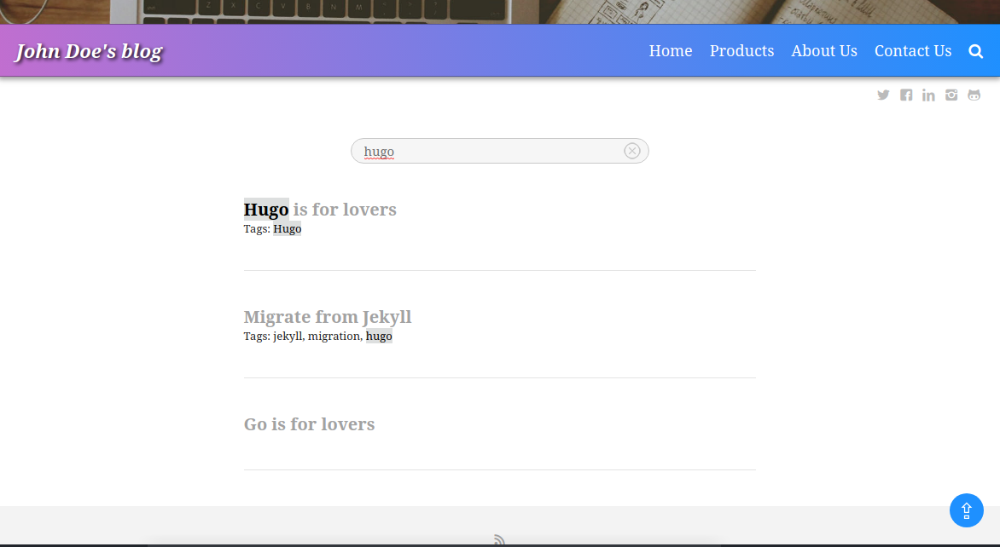
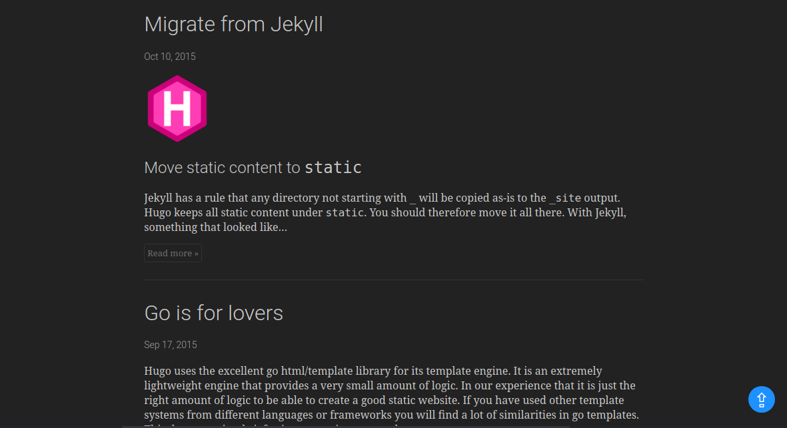
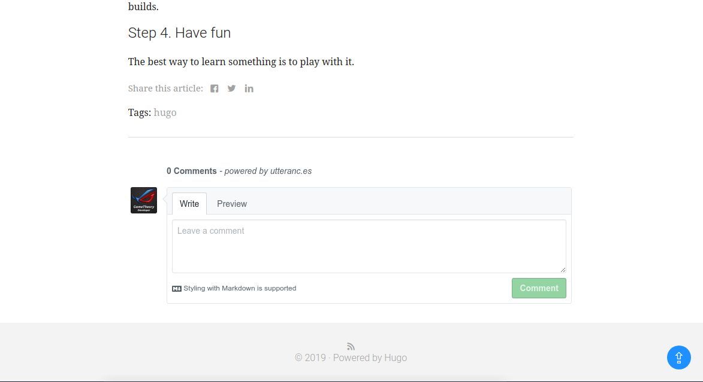

# Flexxy

Flexxy is a responsive theme with a focus on blogging based on the
[Minimalist](https://github.com/digitalcraftsman/hugo-minimalist-theme)
Hugo theme by [digitalcraftsman](https://github.com/digitalcraftsman). This version has been updated with many new features to accomodate the more demanding bloggers. It has also been updated to the newer [base and block constructs](https://gohugo.io/templates/base/).

## Features

- Light and dark mode toggle
- Comment system powered by [Utterances](https://utteranc.es/)
- Easy localization (l10n)
- Support for RSS feeds
- Syntax highlighting for source code snippets
- Social sharing options for blog posts
- Search engine powered by [lunr.js](https://lunrjs.com/)
- Pagination for your blog posts
- Responsive navbar
- Call-to-action button shortcode for things like downloads
- Image modal shortcode to display blog image previews & enlarge on click
- Back-to-top button
- Looks great on desktop and mobile
- Footer copyright updates automatically each year on Jan 1st
- Google analytics to monitor site traffic
- Cookie notification for [GDPR](https://eugdpr.org/) compliance









## Preview & Installation

### Preview

The theme ships with an `exampleSite` folder that acts as a demo setup.
`cd` into this folder and start Hugo:

Note: Below we run the `hugo` command before the `hugo server` command to build the search engine data for [lunr.js](https://lunrjs.com/).

```bash
git clone https://github.com/GameTheory-/flexxy.git
cd flexxy/exampleSite
hugo
hugo server
```

Now enter [localhost:1313](http://localhost:1313/) in the address bar of your browser.

## Installation

If you want to use this theme for an actual website create a new Hugo project and add the theme as a submodule.

In the root directory of your project:

```bash
git submodule add https://github.com/GameTheory-/flexxy.git themes/flexxy
```

**Note:** make sure to remove `themesDir = "../.."` from the top of your config file if you copied it from `exampleSite/config.toml`. Otherwise, Hugo will be unable to find the theme.

For more information read the official [setup guide](https://gohugo.io/overview/installing/) for Hugo.

## The Config File

Take a look inside the [exampleSite](https://github.com/GameTheory-/flexxy/tree/master/exampleSite) folder of this theme.
You'll find a file called [config.toml](https://github.com/GameTheory-/flexxy/blob/master/exampleSite/config.toml).

To use it, copy the [config.toml](https://github.com/GameTheory-/flexxy/blob/master/exampleSite/config.toml) to the root folder of your Hugo site.
Play around with the settings to tweak your site as you like. Make sure to read the comments in the config file.

## ShortCodes

**Button shortcode example:**

You can use the button to open other pages or links in a new tab or the same tab. You can also use the button for downloads. Exclude the `target` if you wish to open in the same tab.

`"button label" | "link" | "target"`

```golang

```

[Here's a blog post with example usage](https://github.com/GameTheory-/flexxy/blob/master/exampleSite/content/post/hugo-is-for-lovers.md).

**Image modal shortcode example:**

The image shortcode can be used to display an image thumbnail in your posts list page which enlarges to the image original size when clicked.

`"image" | "alt and title" | "thumbnail size"`

```golang

```

Note: The alt tag also serves as title.

[Here's a blog post with example usage](https://github.com/GameTheory-/flexxy/blob/master/exampleSite/content/post/migrate-from-jekyll.md).

## Localization (l10n)

Localization allows you to easily translate all strings in your website.
Within [exampleSite/data](https://github.com/GameTheory-/flexxy/tree/master/exampleSite/data) you'll find a file called [l10n.toml](https://github.com/GameTheory-/flexxy/tree/master/exampleSite/datal10n.toml).
If you're not blogging in English replace all strings with their equivalents of your preferred language.

## License

This theme is released under the Apache License 2.0.
For more information read the [License](https://github.com/GameTheory-/flexxy/blob/master/LICENSE.md).

## Acknowledgements

**Thanks to:**

- [Raphael Riegger](https://github.com/rriegger) for creating the original theme.
- [Steve Francia](https://github.com/spf13) for creating Hugo and the awesome community around the project.
- [digitalcraftsman](https://github.com/digitalcraftsman) for bringing Minimalist theme to Hugo.
